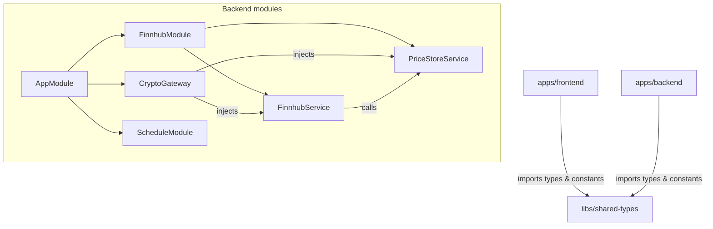

# Architecture

## Nx Workspace Layout

```
cryptocurrency-dashboard/
├── apps/
│   ├── backend/          # NestJS application
│   │   └── src/app/
│   │       ├── finnhub/          # Finnhub WebSocket client
│   │       ├── price-store/      # In-memory price buffer & hourly averages
│   │       └── gateway/          # Socket.IO gateway (browser-facing)
│   │
│   └── frontend/         # React + Vite application
│       └── src/app/
│           ├── hooks/            # useCryptoDashboard (Socket.IO state)
│           └── components/       # PairCard, ConnectionBadge
│
└── libs/
    └── shared-types/     # Shared TypeScript interfaces & constants
```

`shared-types` is the only library. Both apps import from it via the path alias `@cryptocurrency-dashboard/shared-types`, resolved at build time by the `tsconfig.base.json` `paths` entry — no publishing to npm required.

---

## Module Dependency Graph



---

## Backend Module Responsibilities

### `FinnhubModule`
Owns the outbound WebSocket connection to Finnhub and the in-memory price store. Exports both services so `AppModule` providers can inject them.

### `FinnhubService`
- Opens `wss://ws.finnhub.io?token=<KEY>` on startup (`OnModuleInit`).
- Subscribes to the three Binance symbols defined in `FINNHUB_SYMBOLS`.
- Parses incoming `trade` messages and maps symbol strings to `CurrencyPair` values.
- Forwards each `TickerPrice` to `PriceStoreService` and fires registered `onPrice` callbacks.
- Implements exponential back-off reconnection (5 s → doubles → 60 s cap) on close/error.
- Cleans up the socket on `OnModuleDestroy`.

### `PriceStoreService`
- Maintains one ring buffer per pair (max 3 600 entries ≈ 1 hour at 1 tick/s).
- Exposes `addPrice`, `getLatestPrice`, `getPriceHistory`, `getLastHourlyAverage`.
- Has a `@Cron(EVERY_HOUR)` job that scans the last 60 minutes of data, computes the average, persists it, and fires registered `onHourlyAverage` callbacks.

### `CryptoGateway`
- A Socket.IO gateway (`@WebSocketGateway`) that listens for browser connections.
- On `onModuleInit` wires up the Finnhub and schedule callbacks to broadcast events to **all** connected clients via `this.server.emit(...)`.
- On `handleConnection` sends the new client an immediate snapshot (latest price, price history, last hourly average) so the UI is populated before the next real tick.

---

## Frontend Module Responsibilities

### `useCryptoDashboard` hook
- Instantiates a single `socket.io-client` connection to the backend.
- Merges incoming events into a `Record<CurrencyPair, PairState>` React state.
- Keeps the last 60 price points per pair for chart rendering.
- Exposes `pairStates` and `connectionStatus` to the component tree.

### `App`
Top-level layout: header with `ConnectionBadge`, responsive grid of `PairCard` components.

### `PairCard`
Renders one currency pair: current price, last-update timestamp, hourly average, and a live `recharts` `LineChart` with animation disabled (prevents jitter on frequent updates).

### `ConnectionBadge`
Maps `ConnectionStatus.status` to a colored dot + label. The dot pulses via CSS animation while `connecting`.

---

## Data Persistence

There is intentionally **no database**. All state lives in `PriceStoreService`'s in-memory maps. The trade-off:

| | In-memory |
|---|---|
| Setup complexity | None |
| Restart recovery | Lost (clients get empty history until new ticks arrive) |
| Scalability | Single process only |
| Suitable for | Take-home exercise, local development |

If persistence were needed, a time-series store (e.g. InfluxDB, TimescaleDB) or Redis with sorted sets would be natural fits.
