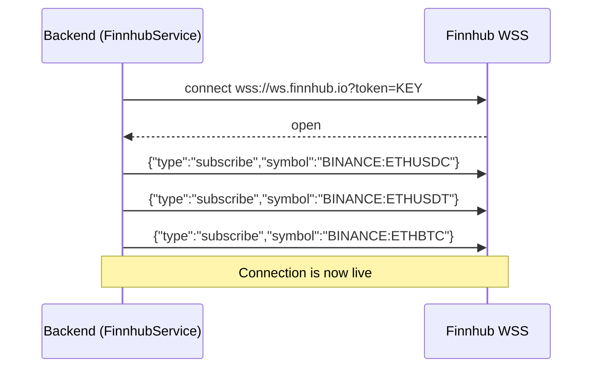
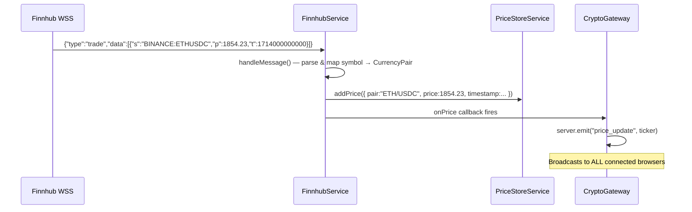
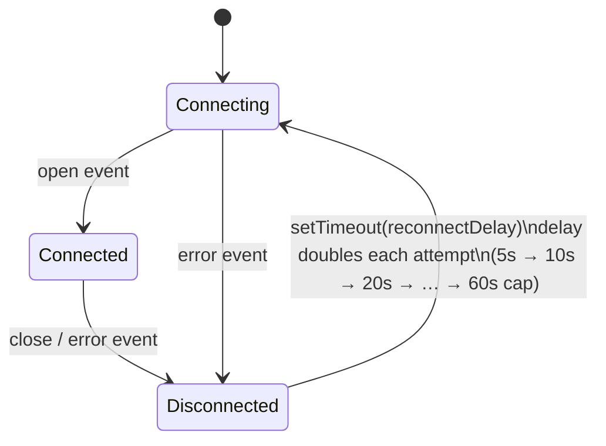
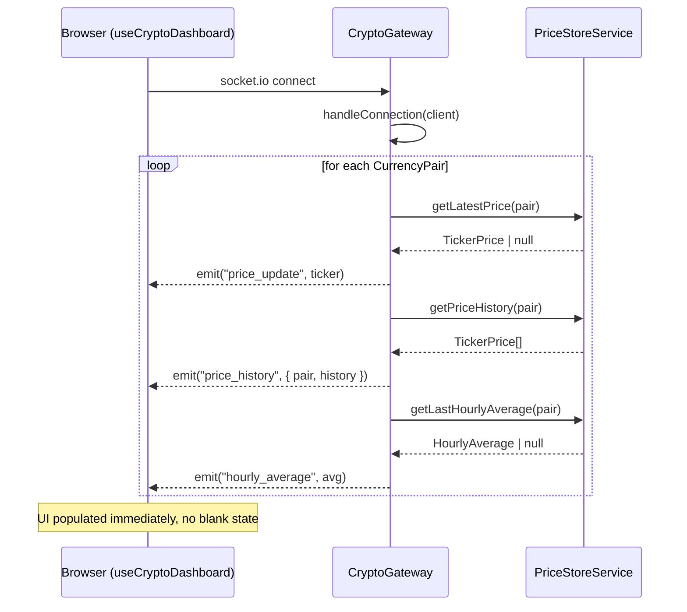
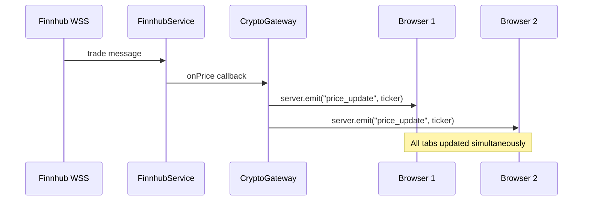
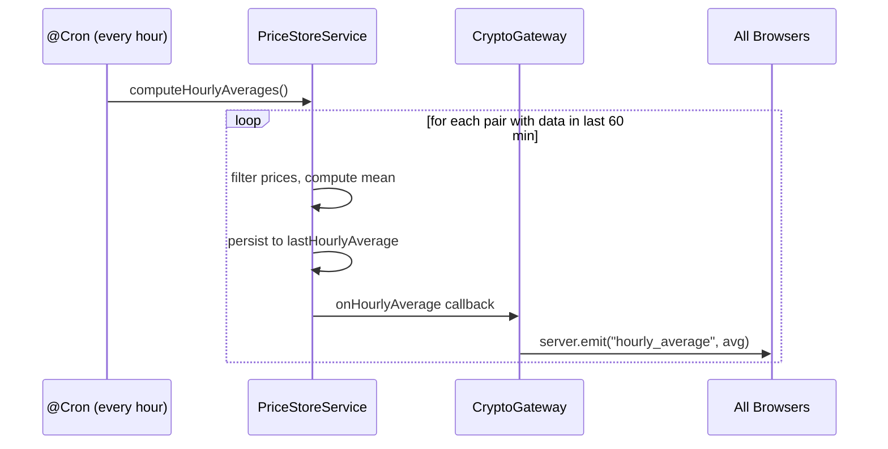
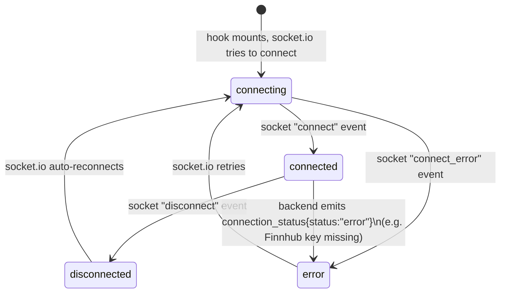

# WebSocket Flows

The system uses **two independent WebSocket connections** with different roles:

| Connection | Direction | Protocol | Purpose |
|---|---|---|---|
| Finnhub WSS | Backend → Finnhub | Native WebSocket (`ws`) | Receive live trade prices |
| Socket.IO | Browser → Backend | Socket.IO over WS | Stream prices to the UI |

---

## Connection 1 — Backend ↔ Finnhub

The backend is the **client**. It opens one persistent connection and subscribes to three symbols.

### Startup sequence

### Receiving a price tick

### Reconnection logic

Reconnection is handled entirely inside `FinnhubService`. The `CryptoGateway` and browsers are unaffected — they receive a `connection_status` event and continue waiting for the next tick.

---

## Connection 2 — Browser ↔ Backend (Socket.IO)

The backend is the **server**. Each browser tab opens its own Socket.IO connection.

### New client connects

### Live price broadcast

### Hourly average broadcast

---

## Connection States (Browser Side)

The `ConnectionBadge` component reflects the status managed by `useCryptoDashboard`:

Note: `connecting` / `connected` / `disconnected` are driven by the **Socket.IO** connection between browser and backend. The separate `error` state from Finnhub is forwarded by the backend as a `connection_status` event and overlaid on top.

---

## Why Two Separate WebSocket Libraries

| Concern | Finnhub side (`ws`) | Browser side (`socket.io`) |
|---|---|---|
| Role | Client only | Server |
| Protocol | Raw WebSocket | WebSocket + HTTP polling fallback |
| Auto-reconnect | Manual (exponential backoff) | Built-in |
| Multiplexing | Not needed | Namespaces / rooms available |
| Message format | JSON strings | JSON with event names |

Using `ws` on the Finnhub side keeps the dependency minimal — there's no need for Socket.IO's server features when acting as a pure client.
